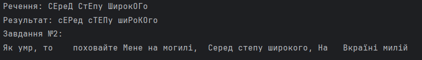

# Лабораторна робота №3
Тема: Операції зі стрічками. Застосування класів-колекцій і класів утиліт. 

Завдання 1: 
Проаналізувати стрічку, яка задана аргументом командного рядка і замінити в ній усі приголосні літери  
приголосними літерами з протилежним регістром символів.  
  
Завдання 2:  
Дано речення, слова в якому розділені пропусками (одним або декількома).  Змінити кожне слово в рядку, вилучивши з нього всі наступні  входження першої букви цього слова (кількість пропусків між словами не змінювати). 

Результат виконання:  

